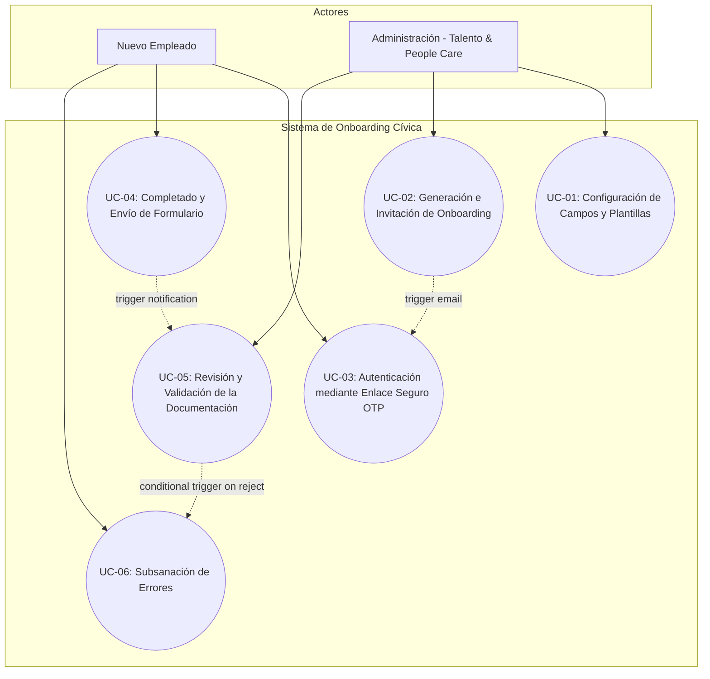
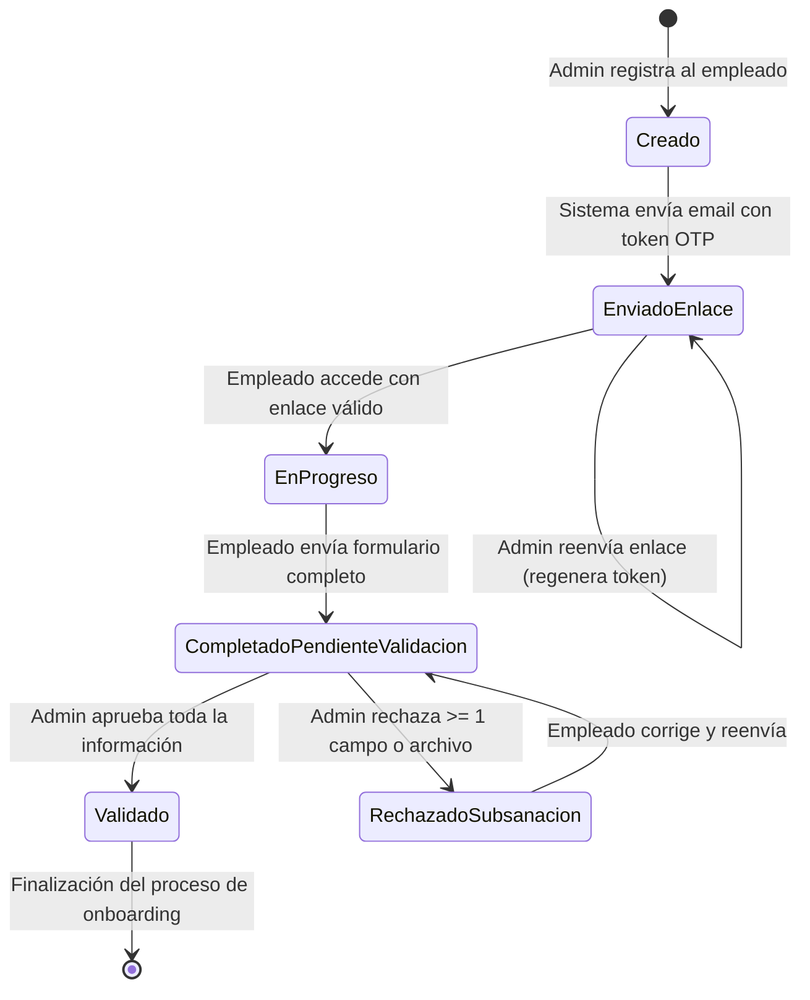

# Fase 1: Análisis y Diseño Funcional
## 01. Análisis de Requisitos y Casos de Uso - Sistema de Onboarding

Este documento detalla el análisis de requisitos de negocio, la especificación de actores, las reglas de negocio para la validación de campos y archivos, y la descripción detallada de los Casos de Uso para la aplicación **Cívica - Nuevas Incorporaciones (Onboarding System)**.

---

## 1. Introducción y Objetivos
El objetivo principal del sistema es digitalizar, automatizar y asegurar el proceso de recopilación y validación de la información y documentación requerida para el alta de nuevos empleados en **Cívica**. 
La solución garantiza:
1. **Autonomía y Flexibilidad:** RRHH puede configurar dinámicamente los campos requeridos y plantillas de documentos.
2. **Seguridad y Privacidad:** Acceso sin contraseñas basado en OTP/Magic Links y almacenamiento seguro de datos de carácter personal y archivos.
3. **Calidad de Datos:** Validaciones rigurosas tanto en cliente (Frontend) como en servidor (Backend) para evitar datos erróneos y agilizar el proceso de incorporación.

---

## 2. Actores del Sistema

El sistema interactúa con dos actores diferenciados:

1. **Nuevo Empleado (Usuario Externo):**
   * **Descripción:** Persona que ha aceptado una oferta de empleo para incorporarse a Cívica, pero que todavía no dispone de una cuenta corporativa en el Directorio Activo de la compañía.
   * **Objetivo:** Acceder de forma segura a su espacio personal de onboarding, rellenar el formulario interactivo, firmar cláusulas, subir los documentos requeridos en el formato correcto y subsanar cualquier incidencia reportada por RRHH.

2. **Administración - Talento y People Care (Administrador):**
   * **Descripción:** Miembros del equipo de Recursos Humanos autorizados para gestionar el proceso de onboarding.
   * **Objetivo:** Configurar formularios y plantillas de documentos, invitar a nuevos empleados, monitorizar el estado del proceso, revisar y validar la documentación enviada de manera individualizada y emitir aprobaciones o solicitudes de subsanación.

---

## 3. Reglas de Negocio (Validación y Seguridad de Datos)

A continuación se detallan las reglas de validación obligatorias aplicadas a nivel de Frontend y Backend.

### A. Validaciones Específicas de Datos

| Campo | Tipo | Obligatorio | Formato / Restricciones de Validación |
| :--- | :--- | :--- | :--- |
| **NSS (Seguridad Social)** | Numérico | Sí | Exactamente 12 dígitos. Expresión regular: `^\d{12}$`. |
| **IBAN** | Alfanumérico | Sí | Formato estándar español: `^ES\d{22}$` (24 caracteres en total, comenzando por ES). Se aplicará el algoritmo de validación de dígitos de control del IBAN. |
| **Dirección Residencia** | Alfanumérico | Sí | Texto libre estructurado en: Calle, número, piso y Código Postal. |
| **Código Postal** | Numérico | Sí | Exactamente 5 dígitos. Expresión regular: `^\d{5}$`. |
| **Preferencia Cobro** | Selección Única | Sí | Exclusivamente: `12 pagas` o `14 pagas`. |
| **Teléfono Emergencia** | Alfanumérico | Sí | Formato estricto: `Nombre - Teléfono - Parentesco`. Expresión regular: `^[A-Za-záéíóúÁÉÍÓÚñÑ\s]+ - \+?[0-9\s]+ - [A-Za-záéíóúÁÉÍÓÚñÑ\s]+$`. |
| **Talla Camiseta** | Selección Única | Sí | Exclusivamente: `XS`, `S`, `M`, `L`, `XL`, `XXL`. |
| **Tipo de Vehículo** | Selección Única | Sí | Exclusivamente: `Turismo` o `Motocicleta`. |
| **Tipo de Combustible** | Selección Única | Sí | Exclusivamente: `Gasolina` o `Diésel`. |
| **Reconocimiento Médico** | Selección Única | Sí | Exclusivamente: `Sí, acepto` o `No, renuncio al reconocimiento médico`. |

### B. Validaciones y Nomenclatura de Archivos

Todos los archivos subidos al sistema deben pasar un filtro de tamaño máximo de **5 Megabytes (5MB)** y poseer una nomenclatura estandarizada. Para evitar colisiones y fugas de directorios, el backend renombrará internamente los archivos usando un UUID único manteniendo una asociación en base de datos. Sin embargo, para la descarga de RRHH, se reconstruirá el nombre según el estándar:

| Documento | Formato Requerido | Nomenclatura Estándar del Archivo | Obligatoriedad |
| :--- | :--- | :--- | :--- |
| **Copia de DNI/NIE** | `PDF` | `DNI [Primer_Apellido] [Segundo_Apellido], [Nombre].pdf` | Obligatorio |
| **Copia de Titulación** | `PDF` | `TITULO [Primer_Apellido] [Segundo_Apellido], [Nombre].pdf` | Obligatorio |
| **Justificante IBAN** | `PDF` | `TITULARIDAD CUENTA [Primer_Apellido] [Segundo_Apellido], [Nombre].pdf` | Obligatorio |
| **Modelo 145** | `PDF` | `MOD145 [Primer_Apellido] [Segundo_Apellido], [Nombre].pdf` | Obligatorio |
| **Cláusula LOPD** | `PDF` | `PROTECCIÓN DATOS [Primer_Apellido] [Segundo_Apellido], [Nombre].pdf` | Obligatorio |
| **Cláusula Uso Imagen** | `PDF` | `USO IMAGENES [Primer_Apellido] [Segundo_Apellido], [Nombre].pdf` | Obligatorio |
| **Alta Demandante** | `PDF` | `DEMANDANTE [Primer_Apellido] [Segundo_Apellido], [Nombre].pdf` | Opcional |
| **Garantía Juvenil** | `PDF` | `GARANTIA [Primer_Apellido] [Segundo_Apellido], [Nombre].pdf` | Opcional |
| **Foto de Perfil** | `JPG` | `[Primer_Apellido] [Segundo_Apellido], [Nombre].jpg` | Obligatorio (Aspecto vertical 3:4, tipo carné) |

### C. Directrices Críticas de Seguridad
1. **Saneamiento de Nombres de Archivo:** Se eliminarán caracteres especiales y secuencias de escape de directorios (`../`, `..\`) del nombre del archivo subido en cliente para prevenir vulnerabilidades de Path Traversal antes de guardarlo en almacenamiento no público.
2. **Validación de Tipo de Contenido Real (Magic Bytes):** El servidor comprobará la cabecera binaria del archivo (Magic Bytes) para asegurar que un archivo `.pdf` sea realmente un PDF y un `.jpg` sea realmente una imagen JPEG, y no un script malicioso renombrado.
3. **Protección de Datos Sensibles (PII Masking):** La interfaz web de administración enmascarará por defecto campos altamente sensibles como el NSS y el IBAN (por ejemplo, `******1234` o `ES***************1234`), permitiendo su visualización completa únicamente a usuarios con privilegios de rol específicos de RRHH y registrando la acción en una bitácora de auditoría.

---

## 4. Diagrama de Casos de Uso (Mermaid.js)

---

## 5. Especificación de Casos de Uso

### UC-01: Configuración de Campos y Plantillas Dinámicas
| Elemento | Descripción |
| :--- | :--- |
| **Actor Principal** | Administración (Talento y People Care) |
| **Precondiciones** | El administrador ha iniciado sesión en la plataforma interna con privilegios de RRHH. |
| **Flujo Principal** | 1. El administrador accede al panel de "Configuración de Onboarding". 2. El sistema muestra la lista de campos actuales y las plantillas cargadas (Modelo 145, Cláusula LOPD, Cláusula Imagen). 3. El administrador puede marcar campos como obligatorios/opcionales o crear campos personalizados (tipo texto, numérico, selección única). 4. El administrador carga una nueva versión en PDF de las plantillas base de documentos. 5. El administrador guarda los cambios. 6. El sistema actualiza la base de datos de configuración y la aplica de forma inmediata para futuros procesos. |
| **Flujos Alternativos / Excepciones** | **A1. Formato de plantilla no válido:** Si el archivo cargado no es un archivo PDF nativo, el sistema muestra un mensaje de error y no guarda los cambios. |
| **Postcondiciones** | La configuración del formulario y las plantillas actualizadas quedan guardadas y listas para su uso por parte de nuevos empleados. |

---

### UC-02: Generación e Invitación de Onboarding
| Elemento | Descripción |
| :--- | :--- |
| **Actor Principal** | Administración (Talento y People Care) |
| **Precondiciones** | El administrador dispone de los datos de contacto iniciales del nuevo empleado (Nombre, Apellidos, Correo Electrónico Personal). |
| **Flujo Principal** | 1. El administrador accede a la sección "Crear Incorporación". 2. El administrador introduce el Nombre, Apellidos y Correo Personal del nuevo empleado. 3. El administrador hace clic en "Enviar Invitación". 4. El sistema registra al nuevo empleado en estado `Creado`. 5. El sistema genera un Token Único Seguro (UUID) asociado a la cuenta y con fecha de expiración (24 horas). 6. El sistema envía un correo de invitación con un enlace seguro (`https://onboarding.civica.es/access?token=UUID`) y adjunta las plantillas vacías (Modelo 145, LOPD, Uso de Imagen). 7. El sistema cambia el estado del onboarding a `EnviadoEnlace`. |
| **Flujos Alternativos / Excepciones** | **A1. Correo electrónico ya registrado:** Si el correo ya pertenece a un onboarding activo o un empleado de la compañía, el sistema bloquea el registro e informa al administrador. **A2. Fallo en el servidor de correo:** Si el servicio de email falla, el sistema muestra un aviso de error, pero registra al empleado en estado `Creado` permitiendo el reenvío manual del enlace. |
| **Postcondiciones** | El registro de incorporación se crea en base de datos y se envía un enlace de acceso seguro al empleado. |

---

### UC-03: Autenticación mediante Enlace Seguro (OTP / Magic Link)
| Elemento | Descripción |
| :--- | :--- |
| **Actor Principal** | Nuevo Empleado |
| **Precondiciones** | El empleado ha recibido un correo electrónico con el enlace de acceso o dispone de un enlace de solicitud de acceso. |
| **Flujo Principal** | 1. El empleado pulsa sobre el enlace enviado en su email o introduce su email personal en la pantalla de acceso. 2. El sistema valida el token de la URL o, si introduce el email, genera y envía un nuevo token temporal por email. 3. El sistema valida que el token existe en base de datos, no ha sido usado y que la fecha/hora actual es anterior a la fecha de expiración. 4. El sistema invalida el token de acceso para que no pueda volver a ser reutilizado (single-use token). 5. El sistema genera una sesión web temporal en el navegador del usuario y establece una cookie HttpOnly segura. 6. El sistema redirige al empleado a su panel de control de onboarding en estado `EnProgreso`. |
| **Flujos Alternativos / Excepciones** | **A1. Token expirado o inválido:** El sistema muestra una pantalla de error ("El enlace ha expirado o no es válido") y ofrece un formulario para solicitar un nuevo enlace de acceso rápido por email. **A2. Control de Fuerza Bruta / Rate Limiting:** Si se detectan más de 5 solicitudes de OTP o intentos de validación incorrectos desde la misma IP en 15 minutos, se bloquea el acceso para esa IP temporalmente (15 minutos). |
| **Postcondiciones** | El empleado obtiene acceso autorizado y seguro a su formulario personalizado de onboarding sin necesidad de contraseña. |

---

### UC-04: Completado y Envío de Formulario
| Elemento | Descripción |
| :--- | :--- |
| **Actor Principal** | Nuevo Empleado |
| **Precondiciones** | El empleado está autenticado en la plataforma y el estado de su onboarding es `EnProgreso` o `RechazadoSubsanacion`. |
| **Flujo Principal** | 1. El sistema presenta el formulario dinámico con los campos definidos por RRHH y el listado de documentos a subir. 2. El empleado completa los campos numéricos (NSS, IBAN, CP) y de selección única. 3. El empleado descarga las plantillas si no lo ha hecho antes, las rellena, las firma digitalmente y las sube junto a los documentos obligatorios (DNI, Título, Justificante IBAN, Foto). 4. El sistema valida el formato de entrada de cada campo y los metadatos de los archivos cargados (tamaño < 5MB, extensión correcta) en tiempo real. 5. El empleado pulsa en "Finalizar y Enviar". 6. El sistema realiza la validación global en Backend (incluyendo Magic Bytes). 7. El sistema guarda la información, pasa el estado a `CompletadoPendienteValidacion` e inhabilita la edición al empleado. 8. El sistema envía una notificación automática (email) al equipo de Talento y People Care avisando de la entrega. |
| **Flujos Alternativos / Excepciones** | **A1. Datos incompletos o inválidos:** Si el empleado intenta enviar el formulario y faltan campos obligatorios o hay formatos incorrectos (ej. IBAN incorrecto), la interfaz marca los errores y bloquea el envío. **A2. Error en formato de archivo (Backend):** Si un archivo subido tiene la extensión cambiada pero su estructura no coincide (ej. un ejecutable con extensión .pdf), el backend rechaza el envío con un error detallado. |
| **Postcondiciones** | Los datos y archivos del empleado quedan registrados de forma segura y se bloquea el formulario para edición externa hasta la revisión de RRHH. |

---

### UC-05: Revisión y Validación de la Documentación
| Elemento | Descripción |
| :--- | :--- |
| **Actor Principal** | Administración (Talento y People Care) |
| **Precondiciones** | Existe un proceso de onboarding en estado `CompletadoPendienteValidacion`. |
| **Flujo Principal** | 1. El administrador accede al panel de revisión del empleado en la aplicación interna. 2. El sistema muestra todos los datos y archivos organizados por secciones. 3. El administrador revisa visualmente la veracidad de la información y la calidad/firma de los documentos. 4. Para cada campo y archivo, el administrador debe marcar la opción "Aprobar" o "Rechazar". 5. Si rechaza un campo/archivo, el sistema obliga a introducir un comentario de subsanación explicando el motivo del rechazo. 6. Si todos los elementos son aprobados, el administrador pulsa "Validar Todo". El estado del onboarding cambia a `Validado` y se envía un email de bienvenida y éxito al empleado. 7. Si uno o más elementos son rechazados, el administrador pulsa "Solicitar Subsanación". El estado del onboarding cambia a `RechazadoSubsanacion`. Se ejecuta el flujo de notificaciones para subsanación. |
| **Flujos Alternativos / Excepciones** | **A1. Intento de guardar sin comentarios en rechazo:** El sistema no permite el envío si hay elementos marcados como rechazados que carecen de una nota explicativa de error. |
| **Postcondiciones** | El proceso de onboarding cambia a un estado final (`Validado`) o se devuelve al flujo de corrección (`RechazadoSubsanacion`) registrando el histórico de validaciones. |

---

### UC-06: Subsanación de Errores
| Elemento | Descripción |
| :--- | :--- |
| **Actor Principal** | Nuevo Empleado, Administración (Talento y People Care) |
| **Precondiciones** | El estado de onboarding es `RechazadoSubsanacion`. |
| **Flujo Principal** | 1. El sistema envía automáticamente un email al empleado informando de que se requiere subsanar información. 2. El email adjunta o enlaza la lista de campos y archivos rechazados junto con los comentarios redactados por RRHH. 3. El empleado utiliza un nuevo enlace seguro (OTP) para acceder a la aplicación. 4. El sistema presenta el formulario mostrando todos los campos correctos bloqueados (sólo lectura) y habilitando la edición únicamente en aquellos campos y archivos rechazados. 5. El empleado corrige la información o sube el nuevo archivo válido. 6. El empleado pulsa "Enviar Subsanación". 7. El sistema valida los datos modificados y pasa el estado del onboarding a `CompletadoPendienteValidacion` avisando a RRHH para una nueva revisión. |
| **Flujos Alternativos / Excepciones** | N/A (Se aplican las mismas restricciones de validación que en el envío inicial). |
| **Postcondiciones** | El empleado reenvía el formulario corregido y queda a la espera de la validación final por parte de Talento y People Care. |

---

## 6. Ciclo de Vida del Estado del Onboarding

El flujo del proceso sigue una máquina de estados estrictamente secuencial y lógica en la que cada transición responde a una acción específica de los actores o del sistema. La máquina de estados conceptual se define de la siguiente manera:

