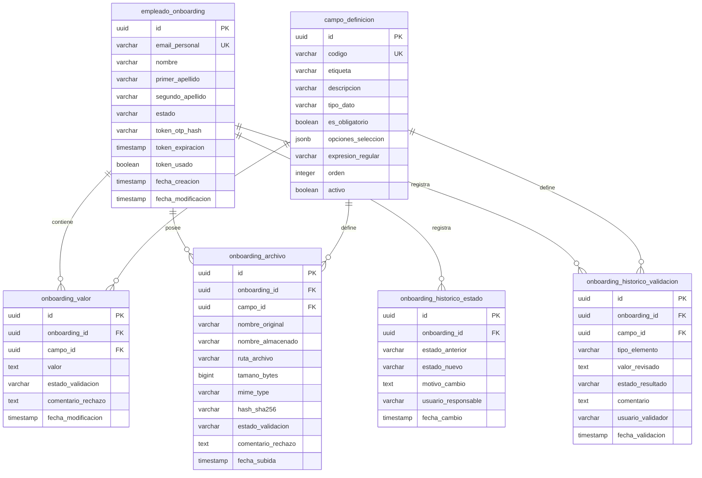

# Fase 1: Análisis y Diseño Funcional
## 02. Modelo de Datos Relacional - Sistema de Onboarding

Este documento describe el diseño de la base de datos relacional para el sistema **Cívica - Nuevas Incorporaciones (Onboarding System)**, orientado a PostgreSQL. Se justifica la arquitectura para soportar formularios dinámicos y se detalla el diccionario de datos físico, restricciones y el diagrama Entidad-Relación (ERD).

---

## 1. Estrategia de Diseño para Formularios Dinámicos

Para cumplir con el requisito de que Recursos Humanos pueda configurar dinámicamente qué datos y documentos solicitar, se han evaluado tres alternativas de diseño en PostgreSQL:

### Alternativas Evaluadas

1. **Patrón EAV (Entity-Attribute-Value) Tradicional:**
   * *Descripción:* Se crean tablas para definir los atributos (campos) y otra para almacenar los valores de forma genérica (generalmente como `TEXT`).
   * *Pros:* Alta flexibilidad, compatible con estándares SQL tradicionales.
   * *Contras:* Requiere múltiples autouniones (JOINs) para reconstruir el registro de un empleado, dificultando las consultas y el rendimiento.

2. **Columnas No Estructuradas (JSONB en PostgreSQL):**
   * *Descripción:* Se almacena toda la respuesta dinámica del empleado en una única columna de tipo `JSONB` dentro de la tabla del proceso de onboarding.
   * *Pros:* Excelente rendimiento de lectura en PostgreSQL, indexable mediante índices GIN, sin JOINs complejos.
   * *Contras:* Pérdida de integridad referencial directa con archivos subidos y dificultad para gestionar validaciones individuales en base de datos.

3. **Modelo Relacional Híbrido Orientado a Objetos (Seleccionado):**
   * *Descripción:* Se divide el esquema en entidades fijas (proceso de onboarding del empleado), una tabla de definición de campos (`campo_definicion`), una tabla de valores de campos de texto/numéricos/opciones (`onboarding_valor`) y una tabla dedicada a los metadatos de archivos con integridad referencial (`onboarding_archivo`).
   * *Justificación:* Mantiene la flexibilidad de configuración del patrón EAV, pero separa la lógica de archivos (que requiere campos especiales de auditoría y seguridad como `mime_type`, `tamano_bytes` y `hash_sha256`) y asegura una integridad referencial estricta.

---

## 2. Diagrama Entidad-Relación (ERD - Mermaid.js)

El siguiente diagrama detalla las tablas de la base de datos, sus llaves primarias (PK), llaves foráneas (FK) y sus relaciones.

---

## 3. Diccionario de Datos

### 3.1. Tabla: `empleado_onboarding`
Almacena la información principal de la invitación de incorporación del empleado y el flujo de autenticación passwordless.

| Columna | Tipo de Datos | Restricciones | Descripción |
| :--- | :--- | :--- | :--- |
| `id` | `UUID` | `PRIMARY KEY` | Identificador único del proceso de onboarding. Generado por la BD (UUID v4). |
| `email_personal` | `VARCHAR(255)` | `NOT NULL, UNIQUE` | Correo electrónico personal del empleado donde recibirá las notificaciones. |
| `nombre` | `VARCHAR(100)` | `NOT NULL` | Nombre de pila del nuevo empleado. |
| `primer_apellido` | `VARCHAR(100)` | `NOT NULL` | Primer apellido del nuevo empleado. |
| `segundo_apellido` | `VARCHAR(100)` | `NULL` | Segundo apellido del nuevo empleado. |
| `estado` | `VARCHAR(50)` | `NOT NULL` | Estado del onboarding: `Creado`, `Enviado_Enlace`, `En_Progreso`, `Completado_Pendiente_Validacion`, `Validado`, `Rechazado_Subsanacion`. |
| `token_otp_hash` | `VARCHAR(64)` | `NULL` | Hash SHA-256 del token OTP/Magic Link temporal generado para el acceso. |
| `token_expiracion` | `TIMESTAMP` | `NULL` | Fecha y hora límite para hacer uso del token OTP activo. |
| `token_usado` | `BOOLEAN` | `NOT NULL, DEFAULT FALSE` | Flag para marcar si el token actual ya ha sido consumido. |
| `fecha_creacion` | `TIMESTAMP` | `NOT NULL, DEFAULT NOW()` | Fecha de registro inicial en el sistema. |
| `fecha_modificacion`| `TIMESTAMP` | `NOT NULL, DEFAULT NOW()` | Fecha de la última modificación en el estado del registro. |

---

### 3.2. Tabla: `campo_definicion`
Tabla de configuración dinámica administrada por RRHH que define los campos requeridos en el formulario.

| Columna | Tipo de Datos | Restricciones | Descripción |
| :--- | :--- | :--- | :--- |
| `id` | `UUID` | `PRIMARY KEY` | Identificador único de la definición del campo. |
| `codigo` | `VARCHAR(50)` | `NOT NULL, UNIQUE` | Código único para identificar el campo (ej: `NSS`, `TALLA_CAMISETA`, `DNI_FILE`). |
| `etiqueta` | `VARCHAR(150)` | `NOT NULL` | Título legible que se mostrará en la UI del formulario (ej: "Número de Seguridad Social"). |
| `descripcion` | `VARCHAR(255)` | `NULL` | Texto explicativo o de ayuda para el usuario al rellenar el campo. |
| `tipo_dato` | `VARCHAR(30)` | `NOT NULL` | Tipo de dato esperado: `TEXTO`, `NUMERICO`, `ARCHIVO`, `SELECCION`. |
| `es_obligatorio` | `BOOLEAN` | `NOT NULL, DEFAULT TRUE` | Determina si el campo debe ser completado obligatoriamente para enviar el formulario. |
| `opciones_seleccion`| `JSONB` | `NULL` | Array JSON con las opciones si es de tipo `SELECCION` (ej: `["XS", "S", "M", "L"]`). |
| `expresion_regular`| `VARCHAR(255)` | `NULL` | Regex utilizada para validar el formato de entrada tanto en Frontend como en Backend. |
| `orden` | `INTEGER` | `NOT NULL, DEFAULT 0` | Controla la posición visual del campo en el formulario dinámico. |
| `activo` | `BOOLEAN` | `NOT NULL, DEFAULT TRUE` | Determina si el campo está actualmente activo en la versión vigente del formulario. |

---

### 3.3. Tabla: `onboarding_valor`
Almacena las respuestas del empleado a los campos del formulario dinámico (excluyendo archivos).

| Columna | Tipo de Datos | Restricciones | Descripción |
| :--- | :--- | :--- | :--- |
| `id` | `UUID` | `PRIMARY KEY` | Identificador único del valor. |
| `onboarding_id` | `UUID` | `FK (empleado_onboarding) NOT NULL` | Relación con el proceso de onboarding del empleado. Borrado en cascada. |
| `campo_id` | `UUID` | `FK (campo_definicion) NOT NULL` | Relación con la definición del campo. |
| `valor` | `TEXT` | `NULL` | El valor en formato de texto introducido por el empleado. |
| `estado_validacion`| `VARCHAR(30)` | `NOT NULL, DEFAULT 'PENDIENTE'`| Estado de validación por RRHH: `PENDIENTE`, `APROBADO`, `RECHAZADO`. |
| `comentario_rechazo`| `TEXT` | `NULL` | Comentario explicativo redactado por RRHH en caso de marcarse como `RECHAZADO`. |
| `fecha_modificacion`| `TIMESTAMP` | `NOT NULL, DEFAULT NOW()` | Fecha y hora en la que se grabó o modificó la respuesta. |

---

### 3.4. Tabla: `onboarding_archivo`
Gestiona de forma segura los metadatos de los archivos físicos cargados por el empleado.

| Columna | Tipo de Datos | Restricciones | Descripción |
| :--- | :--- | :--- | :--- |
| `id` | `UUID` | `PRIMARY KEY` | Identificador único del archivo y que coincide con el nombre en disco. |
| `onboarding_id` | `UUID` | `FK (empleado_onboarding) NOT NULL` | Relación con el proceso de onboarding del empleado. |
| `campo_id` | `UUID` | `FK (campo_definicion) NOT NULL` | Relación con el campo dinámico tipo `ARCHIVO` que originó la subida. |
| `nombre_original` | `VARCHAR(255)` | `NOT NULL` | Nombre del archivo original subido por el usuario (ej: `DNI.pdf`). |
| `nombre_almacenado`| `VARCHAR(255)` | `NOT NULL` | Nombre físico aleatorio (UUID) con el que se almacena en el sistema de archivos seguro. |
| `ruta_archivo` | `VARCHAR(512)` | `NOT NULL` | Ruta lógica/física absoluta del archivo fuera del directorio web público. |
| `tamano_bytes` | `BIGINT` | `NOT NULL` | Tamaño en bytes del archivo. Límite máximo validado: 5,242,880 bytes (5MB). |
| `mime_type` | `VARCHAR(100)` | `NOT NULL` | Tipo MIME oficial validado mediante Magic Bytes (ej: `application/pdf`, `image/jpeg`). |
| `hash_sha256` | `VARCHAR(64)` | `NOT NULL` | Hash SHA-256 del contenido del archivo para asegurar la integridad y evitar duplicados. |
| `estado_validacion`| `VARCHAR(30)` | `NOT NULL, DEFAULT 'PENDIENTE'`| Estado de validación por RRHH: `PENDIENTE`, `APROBADO`, `RECHAZADO`. |
| `comentario_rechazo`| `TEXT` | `NULL` | Comentario explicativo en caso de rechazo del documento. |
| `fecha_subida` | `TIMESTAMP` | `NOT NULL, DEFAULT NOW()` | Fecha y hora de subida del archivo. |

---

### 3.5. Tabla: `onboarding_historico_estado`
Tabla de auditoría para registrar cada cambio de estado global que experimenta el expediente de onboarding.

| Columna | Tipo de Datos | Restricciones | Descripción |
| :--- | :--- | :--- | :--- |
| `id` | `UUID` | `PRIMARY KEY` | Identificador único del evento de auditoría. |
| `onboarding_id` | `UUID` | `FK (empleado_onboarding) NOT NULL` | Proceso de onboarding auditado. |
| `estado_anterior` | `VARCHAR(50)` | `NULL` | Estado del que provenía el expediente. |
| `estado_nuevo` | `VARCHAR(50)` | `NOT NULL` | Estado actual asignado al expediente. |
| `motivo_cambio` | `TEXT` | `NULL` | Nota explicativa sobre el cambio de estado. |
| `usuario_responsable`| `VARCHAR(255)`| `NOT NULL` | Identificador (email de RRHH, 'SISTEMA' o 'EMPLEADO') que desencadenó el cambio. |
| `fecha_cambio` | `TIMESTAMP` | `NOT NULL, DEFAULT NOW()` | Instante temporal del cambio de estado. |

---

### 3.6. Tabla: `onboarding_historico_validacion`
Historial de aprobaciones y rechazos puntuales de campos y archivos, permitiendo auditoría sobre subsanaciones previas.

| Columna | Tipo de Datos | Restricciones | Descripción |
| :--- | :--- | :--- | :--- |
| `id` | `UUID` | `PRIMARY KEY` | Identificador único del evento de validación. |
| `onboarding_id` | `UUID` | `FK (empleado_onboarding) NOT NULL` | Relación con el proceso de onboarding. |
| `campo_id` | `UUID` | `FK (campo_definicion) NOT NULL` | Relación con el campo evaluado. |
| `tipo_elemento` | `VARCHAR(20)` | `NOT NULL` | Determina el tipo de objeto validado: `CAMPO` o `ARCHIVO`. |
| `valor_revisado` | `TEXT` | `NOT NULL` | Copia del valor o del nombre del archivo que fue revisado en esta iteración. |
| `estado_resultado` | `VARCHAR(30)` | `NOT NULL` | Resultado de la validación: `APROBADO` o `RECHAZADO`. |
| `comentario` | `TEXT` | `NULL` | Comentario ingresado por el validador. |
| `usuario_validador`| `VARCHAR(255)`| `NOT NULL` | Email del usuario de RRHH que realizó la validación. |
| `fecha_validacion` | `TIMESTAMP` | `NOT NULL, DEFAULT NOW()` | Fecha y hora en la que se ejecutó la validación. |

---

## 4. Integridad Referencial y Restricciones Físicas

* **Claves Primarias (PK) y Foráneas (FK):** Todas las relaciones se gestionan a través de UUIDv4 generados por la base de datos, lo que dificulta la enumeración de recursos (evitando vulnerabilidades IDOR) en las URLs de la aplicación.
* **Borrado en Cascada (ON DELETE CASCADE):** 
  * Al eliminar un expediente en `empleado_onboarding`, se eliminan en cascada sus respuestas en `onboarding_valor` y metadatos en `onboarding_archivo`.
  * *Nota de Seguridad:* La eliminación física en disco del archivo almacenado debe ser coordinada por el servicio backend al procesar la cascada.
* **Índices de Rendimiento y Búsqueda (Indexes):**
  * Índices únicos en `empleado_onboarding(email_personal)` y `campo_definicion(codigo)`.
  * Índice compuesto en `onboarding_valor(onboarding_id, campo_id)` para búsquedas y actualizaciones veloces.
  * Índice compuesto en `onboarding_archivo(onboarding_id, campo_id)` para obtener rápidamente los documentos cargados por un empleado.
