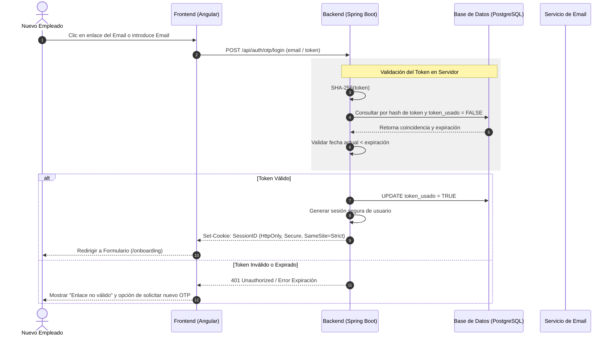
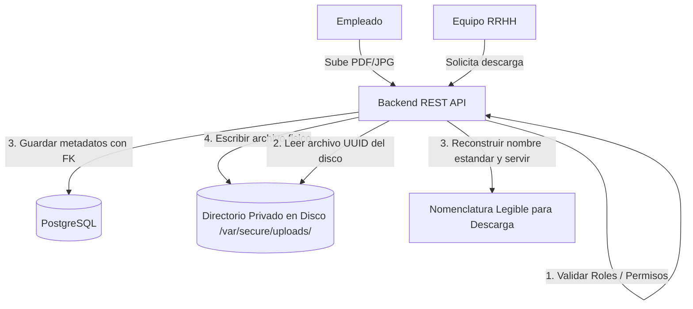
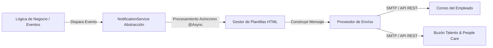

# Fase 1: Análisis y Diseño Funcional
## 03. Diseño de Arquitectura y Seguridad - Sistema de Onboarding

Este documento detalla las justificaciones y especificaciones de arquitectura de software, mecanismos de seguridad, modelo de transiciones de estados e integración de servicios del sistema **Cívica - Nuevas Incorporaciones (Onboarding System)**.

---

## 🔐 1. Mecanismo de Autenticación Passwordless / OTP

Dado que los nuevos empleados no disponen de cuentas corporativas activas ni están registrados en el Directorio Activo de la compañía, se implementa un mecanismo de acceso sin contraseña seguro y temporal.



### Especificación Técnica de Seguridad (OTP)
1. **Generación Criptográfica Fuerte:** Los tokens de acceso se generarán utilizando un generador de números aleatorios criptográficamente seguro (como `SecureRandom` en Java) y se codificarán en Base64 o representarán como un UUID v4.
2. **Almacenamiento Seguro (Hashing):** El servidor **nunca** almacenará los tokens OTP en texto plano en la base de datos para evitar que un acceso no autorizado a la misma permita comprometer accesos activos. Se almacenará únicamente el Hash SHA-256 del token (`token_otp_hash`).
3. **Ciclo de Vida y Expiración:**
   * **Duración Corta:** Los enlaces de acceso iniciales expiran en 24 horas. Los enlaces OTP de reintento o subsanación expiran en 15 minutos.
   * **Un Solo Uso (Single-Use):** Una vez que el backend valida el token con éxito, inmediatamente marca en la base de datos `token_usado = TRUE` invalidándolo para futuras peticiones.
4. **Manejo de Sesión Web:**
   * Al validarse el OTP, el backend emite una cookie de sesión cifrada que almacena el identificador de sesión.
   * La cookie se configurará con las directrices de seguridad recomendadas:
     * `HttpOnly`: Previene el acceso al token mediante scripts JavaScript (protección ante robo de sesión por XSS).
     * `Secure`: Obliga a que la cookie sólo sea transmitida sobre conexiones HTTPS.
     * `SameSite=Strict`: Restringe la cookie para que no sea enviada en peticiones de origen cruzado, mitigando ataques CSRF.
5. **Mitigación de Fuerza Bruta y Denial of Service (DoS):**
   * Se aplicará un **Rate Limiting** a nivel de la API de autenticación (`POST /api/auth/otp/login` y `POST /api/auth/otp/request`).
   * Límite: Máximo 5 peticiones de autenticación por IP y correo electrónico en un intervalo de 15 minutos. Superado el límite, el backend devolverá `HTTP 429 Too Many Requests`.

---

## 📁 2. Almacenamiento Seguro de Ficheros (PDF/JPG)

Los documentos subidos por los nuevos empleados (DNI, IBAN, Modelo 145, etc.) son Datos de Carácter Personal (RGPD). Su almacenamiento y descarga deben estar estrictamente controlados.



### Especificación Técnica de Almacenamiento
1. **Ubicación del Almacenamiento (Storage System):**
   * **Opción Local:** Se almacenarán en una ruta del sistema de archivos del servidor backend (ej. `/var/secure/onboarding/uploads/`) que esté completamente **fuera de la raíz pública del servidor web**. Ninguna petición HTTP directa puede acceder a este directorio.
   * **Opción Cloud (Recomendada para escalabilidad):** Object Storage privado (como AWS S3 o GCP Cloud Storage) configurado con acceso público bloqueado y permitiendo la descarga solo mediante credenciales seguras de backend (BFF pattern).
2. **Nomenclatura y Prevención de Path Traversal:**
   * Al recibir un archivo, el backend ignora el nombre del archivo enviado por el cliente para evitar ataques de Path Traversal (`../../etc/passwd`).
   * Se genera un UUID único y el archivo físico se guarda bajo ese nombre en el disco (ej. `f9c2d1b0-e8b2-4c28-98e1-55c68ff85bb6.bin`).
   * En la tabla `onboarding_archivo` se asocia el UUID con el nombre real e higienizado para su reconstrucción bajo demanda.
3. **Descargas Controladas y Cabeceras HTTP de Seguridad:**
   * La descarga de archivos requiere autenticación y rol de administrador (`Administración - Talento y People Care`).
   * El controlador API servirá los archivos configurando de forma estricta las siguientes cabeceras:
     * `Content-Type`: El MIME-Type oficial verificado (ej: `application/pdf`).
     * `Content-Disposition: attachment; filename="DNI apellido apellido, nombre.pdf"` (Fuerza la descarga en disco evitando que navegadores vulnerables interpreten el contenido).
     * `X-Content-Type-Options: nosniff` (Previene ataques de sniffing de contenido).

---

## 🚦 3. Máquina de Estados del Expediente de Onboarding

La máquina de estados conceptual define el ciclo de vida del proceso de onboarding de cada nuevo empleado, regulando las acciones permitidas y la visibilidad de los datos.

```
       [ Inicio ]
           │
           ▼
      ┌──────────┐
      │ Creado   │ ◄────────────────────────────────────────┐
      └────┬─────┘                                          │
           │ (Admin envía enlace OTP)                       │
           ▼                                                │
    ┌──────────────┐                                        │
    │EnviadoEnlace │ ◄───────────────────┐                  │
    └──────┬───────┘                     │                  │
           │ (Empleado usa enlace)       │ (Admin reenvía   │ (Expiración /
           ▼                             │  enlace OTP)     │  Reinicio)
     ┌──────────┐                        │                  │
     │EnProgreso├────────────────────────┘                  │
     └─────┬────┘                                           │
           │ (Empleado envía formulario completo)           │
           ▼                                                │
┌────────────────────────────┐                              │
│CompletadoPendienteValidac  ├──────────────────────────────┘
└──────────┬─────────────────┘
           │
           ├──────────────────────────────┐ (Admin rechaza >= 1 campo/archivo)
           │ (Admin aprueba todo)         ▼
           ▼                      ┌────────────────────────┐
     ┌──────────┐                 │  RechazadoSubsanacion  │
     │ Validado │                 └───────────┬────────────┘
     └──────────┘                             │ (Empleado corrige y reenvía)
           │                                  ▼
       [ Fin ]                                └─► Retorna a Completado
```

### Transiciones y Reglas de Negocio
* **Creado:** Expediente inicial registrado en base de datos. El empleado no puede acceder porque no posee token.
* **Enviado_Enlace:** Se ha generado el hash OTP y se ha enviado el correo. El empleado puede autenticarse. Si expira o el administrador lo decide, se puede regenerar y reenviar (reiniciando la expiración).
* **En_Progreso:** El empleado ha accedido. El formulario web está desbloqueado para que el empleado complete la información.
* **Completado_Pendiente_Validacion:** El empleado ha guardado y enviado todos los requisitos obligatorios. **El formulario se bloquea** en el frontend y no se permiten modificaciones del empleado. Se envía notificación a RRHH.
* **Validado:** El administrador de RRHH ha aprobado el 100% de los campos y archivos. El proceso de onboarding se cierra con éxito y se inicia el flujo de contratación corporativo.
* **Rechazado_Subsanacion:** Si RRHH detecta un error en cualquier campo o archivo (por ejemplo, firma ausente en Modelo 145 o NSS erróneo), rechaza esos elementos específicos agregando un comentario explicativo. **El formulario se desbloquea únicamente para los elementos rechazados**, manteniendo el resto en modo lectura para el empleado. Una vez corregido, retorna a `Completado_Pendiente_Validacion`.

---

## ✉️ 4. Estrategia de Notificaciones por Email

Las comunicaciones por correo electrónico son el canal clave de interacción entre el sistema, el empleado y RRHH. Se conceptualiza un servicio desacoplado y robusto de mensajería.



### Directrices de Implementación
1. **Desacoplamiento y Abstracción (`NotificationService`):**
   * Se definirá una interfaz genérica de notificaciones. Esto permite cambiar el canal o proveedor (ej. un servidor de correo corporativo local SMTP por un proveedor externo SaaS como Amazon SES, SendGrid o Mailjet) sin modificar la lógica de negocio.
2. **Procesamiento Asíncrono y Tolerancia a Fallos:**
   * El envío de correos electrónicos requiere peticiones de red externas que pueden ralentizar la respuesta de la API o fallar temporalmente.
   * El backend procesará los envíos de forma asíncrona (usando `@Async` en Spring Boot o mediante un sistema de colas en segundo plano).
   * Se implementará una política de reintentos con backoff exponencial para casos de fallos de red con el servidor de correos.
3. **Seguridad en las Comunicaciones (Cifrado y Verificación):**
   * Todos los correos de invitación deben usar obligatoriamente TLS/SSL para el envío.
   * Los enlaces seguros inyectados en los correos incluirán el host HTTPS absoluto configurado de forma segura en las variables de entorno de producción.
   * Las plantillas de email utilizarán codificación de caracteres UTF-8 y escapado de caracteres para evitar la inyección de código malicioso en los textos que visualiza el destinatario.
