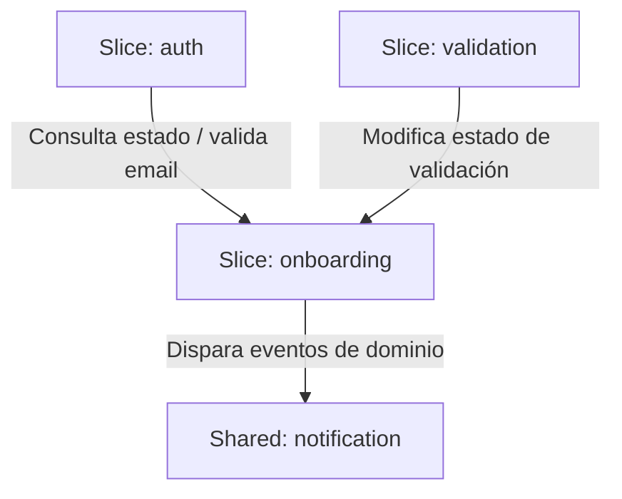

# Fase 1: Análisis y Diseño Funcional
## 04. Definición de Servicios y Slices - Sistema de Onboarding

Este documento formaliza la arquitectura del backend para la aplicación **Cívica - Nuevas Incorporaciones (Onboarding System)**. Se describe la estructura organizativa basada en **Vertical Slices** y el patrón de **Arquitectura Hexagonal (Puertos y Adaptadores)** para cada módulo, asegurando el desacoplamiento, la testabilidad y el aislamiento de la lógica de negocio.

---

## 1. Principios de Arquitectura

El sistema se diseñará combinando dos patrones arquitectónicos clave:

1. **Vertical Slices (Rebanadas Verticales):**
   * El código se organiza en torno a características de negocio (slices) y no por componentes tecnológicos (controladores, servicios, repositorios en paquetes planos globales).
   * Cada slice es independiente y contiene todo lo necesario para cumplir con su caso de uso (desde el endpoint HTTP hasta la persistencia).
   * Esto reduce el acoplamiento y facilita el desarrollo, mantenimiento y refactorización de funcionalidades individuales.

2. **Arquitectura Hexagonal (Ports & Adapters):**
   * Dentro de cada slice, se aísla el núcleo de negocio (Dominio y Aplicación) de los detalles tecnológicos (Frameworks, Bases de Datos, APIs Externas).
   * **Domain (Núcleo):** Contiene las entidades puras de negocio, reglas de validación intrínsecas y eventos. No depende de ninguna librería externa (salvo Lombok).
   * **Application (Ports & Use Cases):** Define los casos de uso (puertos de entrada) e interfaces para interactuar con el exterior (puertos de salida).
   * **Infrastructure (Adapters):** Implementa los detalles técnicos. Controladores REST (adaptador de entrada), repositorios Spring Data JPA (adaptador de salida) y clientes externos.

---

## 2. Estructura de Paquetes y Directorios

La estructura de directorios del backend en Java Spring Boot (`src/main/java/es/civica/onboarding`) se define de la siguiente manera:

```
es/civica/onboarding/
│
├── auth/                                    <-- Slice de Autenticación y Acceso (OTP)
│   ├── domain/                              
│   │   ├── model/                           <-- OTPToken, Session
│   │   └── exception/                       <-- InvalidTokenException, TokenExpiredException
│   ├── application/                         
│   │   ├── port/                            
│   │   │   ├── inbound/                     <-- LoginUseCase, RequestOtpUseCase
│   │   │   └── outbound/                    <-- OtpTokenRepositoryPort, HashServicePort
│   │   └── service/                         <-- LoginService, RequestOtpService
│   └── infrastructure/                      
│       └── adapter/                         
│           ├── inbound/web/                 <-- AuthController, DTOs (Request/Response)
│           └── outbound/persistence/        <-- OtpTokenRepositoryAdapter, OtpTokenEntity (JPA)
│
├── configuration/                           <-- Slice de Parametrización de Formularios
│   ├── domain/                              
│   │   └── model/                           <-- CampoDefinicion, TipoDato (enum)
│   ├── application/                         
│   │   ├── port/                            
│   │   │   ├── inbound/                     <-- GetActiveFormUseCase, SaveFieldConfigUseCase
│   │   │   └── outbound/                    <-- CampoDefinicionRepositoryPort
│   │   └── service/                         <-- FormConfigurationService
│   └── infrastructure/                      
│       └── adapter/                         
│           ├── inbound/web/                 <-- ConfigurationController, DTOs
│           └── outbound/persistence/        <-- CampoDefinicionRepositoryAdapter, CampoDefinicionEntity (JPA)
│
├── onboarding/                              <-- Slice del Expediente del Empleado (Core)
│   ├── domain/                              
│   │   ├── model/                           <-- EmpleadoOnboarding (Aggregate Root), EstadoOnboarding (enum)
│   │   └── event/                           <-- OnboardingCreadoEvent, FormularioEnviadoEvent
│   ├── application/                         
│   │   ├── port/                            
│   │   │   ├── inbound/                     <-- CreateOnboardingUseCase, SubmitFormUseCase, GetOnboardingUseCase
│   │   │   └── outbound/                    <-- OnboardingRepositoryPort, FileStoragePort
│   │   └── service/                         <-- OnboardingService, SubmitFormService
│   └── infrastructure/                      
│       └── adapter/                         
│           ├── inbound/web/                 <-- OnboardingController, DTOs
│           ├── outbound/persistence/        <-- OnboardingRepositoryAdapter, EmpleadoOnboardingEntity (JPA)
│           └── outbound/storage/            <-- LocalFileStorageAdapter (Acceso a disco privado)
│
├── validation/                              <-- Slice de Revisión y Control de RRHH
│   ├── domain/                              
│   │   └── model/                           <-- ValidacionDecision, HistoricoValidacion
│   ├── application/                         
│   │   ├── port/                            
│   │   │   ├── inbound/                     <-- ReviewElementUseCase, FinalizeReviewUseCase
│   │   │   └── outbound/                    <-- ValidacionRepositoryPort
│   │   └── service/                         <-- ValidationService
│   └── infrastructure/                      
│       └── adapter/                         
│           ├── inbound/web/                 <-- ValidationController, DTOs
│           └── outbound/persistence/        <-- ValidacionRepositoryAdapter, ValidacionEntity (JPA)
│
└── shared/                                  <-- Elementos comunes e Infraestructura transversal
    ├── domain/                              <-- Clases base de dominio (ej. Entity, ValueObject si aplica)
    └── infrastructure/                      
        ├── security/                        <-- Configuración de Spring Security, Filtros JWT y Cookies HttpOnly
        └── notification/                    <-- Adaptador SMTP/Mail Sender común (EmailNotificationAdapter)
```

---

## 3. Detalle de los Slices

### 3.1. Slice `auth` (Autenticación OTP)
* **Propósito:** Gestionar el ciclo de vida de los enlaces seguros temporales de un solo uso (OTP/Magic Links) y emitir la sesión segura.
* **Componentes clave:**
  * `OTPToken` (Domain Model): Contiene el token hash, fecha de expiración, flag de usado y email asociado.
  * `LoginUseCase` (Inbound Port): Interfaz que expone la lógica para autenticar con un token.
  * `RequestOtpUseCase` (Inbound Port): Interfaz para solicitar el reenvío de un enlace.
  * `OtpTokenRepositoryPort` (Outbound Port): Puerto para persistir y buscar los tokens.
  * `HashServicePort` (Outbound Port): Abstracción para hashear el token con SHA-256 antes de guardarlo en BD.
  * `AuthController` (Inbound Adapter): Endpoint REST `POST /api/auth/otp/login` y `POST /api/auth/otp/request`. Al loguearse correctamente, escribe la cookie HttpOnly en la respuesta HTTP.

### 3.2. Slice `configuration` (Parametrización de Formularios)
* **Propósito:** Permitir al equipo de RRHH la definición dinámica de campos del formulario (etiquetas, regex de validación, tipos de datos, obligatoriedad).
* **Componentes clave:**
  * `CampoDefinicion` (Domain Model): Atributos de configuración del campo (ej. `codigo: NSS`, `expresion_regular: ^\d{12}$`).
  * `GetActiveFormUseCase` (Inbound Port): Utilizado por el portal del candidato para recuperar la estructura vigente del formulario dinámico.
  * `SaveFieldConfigUseCase` (Inbound Port): Utilizado por RRHH para crear/actualizar la configuración de un campo.
  * `ConfigurationController` (Inbound Adapter): Controlador con endpoints para obtener la plantilla activa y guardar cambios de configuración.

### 3.3. Slice `onboarding` (Expediente del Candidato)
* **Propósito:** Constituye el núcleo de la aplicación. Gestiona la creación de expedientes, el llenado interactivo del formulario y la subida segura de archivos asociados.
* **Componentes clave:**
  * `EmpleadoOnboarding` (Aggregate Root): Encapsula la información del candidato, el estado actual del proceso (`Creado`, `EnProgreso`, `CompletadoPendienteValidacion`, etc.) y las colecciones de respuestas (`onboarding_valor` y `onboarding_archivo`).
  * `SubmitFormUseCase` (Inbound Port): Procesa la entrega final de datos y archivos por parte del candidato, ejecutando las reglas de validación globales.
  * `FileStoragePort` (Outbound Port): Abstracción para guardar físicamente los archivos. Su adaptador en infraestructura (`LocalFileStorageAdapter`) se encargará del renombrado a UUID y escritura en un directorio privado del servidor.
  * `OnboardingRepositoryPort` (Outbound Port): Persistencia del expediente y sus valores.

### 3.4. Slice `validation` (Revisión y Control de RRHH)
* **Propósito:** Proveer la lógica de auditoría y revisión. RRHH puede evaluar cada dato/archivo de forma individualizada, marcándolos como Aprobados o Rechazados con un comentario de subsanación.
* **Componentes clave:**
  * `ValidacionDecision` (Domain Model): Representa el dictamen de RRHH sobre un campo/archivo específico.
  * `ReviewElementUseCase` (Inbound Port): Procesa la aprobación o rechazo con comentario de un elemento.
  * `FinalizeReviewUseCase` (Inbound Port): Evalúa el estado completo de la revisión. Si todo es aprobado, transiciona a `Validado`. Si hay rechazos, cambia a `RechazadoSubsanacion`.

---

## 4. Estrategia de Comunicación e Integración entre Slices

Para mantener la independencia de los *slices* y evitar dependencias cíclicas en el código, se establecen las siguientes directrices:



1. **Dependencia Directa Unidireccional por Puertos:**
   Un slice puede depender de otro llamando exclusivamente a su **Inbound Port** (interfaz de caso de uso). Nunca se debe inyectar un servicio interno o acceder a un repositorio/entidad JPA de otro slice.
   * *Ejemplo:* El slice `auth`, al validar un token con éxito, puede invocar al puerto `GetOnboardingUseCase` del slice `onboarding` para obtener los datos del empleado y establecer la sesión.

2. **Eventos de Dominio (Domain Events) Asíncronos:**
   Para flujos reactivos desacoplados, se utilizará el sistema de eventos de Spring (`ApplicationEventPublisher`).
   * *Caso de uso:* Cuando el empleado finaliza su formulario, el slice `onboarding` publica un evento `FormularioEnviadoEvent`.
   * El slice de notificaciones (`shared/notification`) escucha este evento asíncronamente (`@EventListener` + `@Async`) para enviar el correo a RRHH, sin que el slice `onboarding` tenga conocimiento de cómo se envían los correos.

---

## 5. Estrategia de Mapeo de Entidades (Entity Mapping)

Una de las dificultades en la arquitectura hexagonal con JPA es evitar que las anotaciones de base de datos (`@Entity`, `@Table`, `@Column`) contaminen el dominio puro.

### Decisión de Diseño: Mapeadores de Capa (Mappers)
Se implementarán **entidades de dominio puras** (en la carpeta `domain/model`) y **entidades de persistencia JPA** (en la carpeta `infrastructure/adapter/outbound/persistence`).
* Las entidades de dominio se diseñan utilizando POJOs puros con lógica de negocio y encapsulación.
* Las entidades de persistencia son estructuras de datos optimizadas para la base de datos de PostgreSQL con anotaciones JPA.
* Se utilizarán mappers específicos (ej. manuales o mediante **MapStruct**) en los adaptadores de infraestructura para convertir de dominio a persistencia y viceversa al guardar o leer de la base de datos.

---

## 6. Seguridad y Validación de Archivos en la Infraestructura

El almacenamiento seguro y la validación de archivos es una responsabilidad técnica crítica del slice `onboarding` delegada en su infraestructura:

1. **Higienización y renombrado (UUID):** El adaptador `LocalFileStorageAdapter` recibirá el archivo físico, extraerá la extensión y descartará el nombre original. Guardará el archivo con un UUID (ej. `f9c2d1b0-e8b2.bin`) y retornará la ruta interna.
2. **Validación de Magic Bytes:** Antes de almacenar el archivo en disco, el adaptador de entrada o un validador en la capa de aplicación utilizará una librería como Apache Tika o validación binaria nativa para comprobar que el flujo de bytes se corresponda con el tipo MIME esperado (ej. verificar la cabecera `%PDF-` para archivos PDF).
3. **Descarga Segura:** La descarga por parte de RRHH se realiza a través de un endpoint en `ValidationController` que verifica el rol del usuario, carga el archivo por su UUID desde el almacenamiento privado, y lo sirve con cabeceras `Content-Disposition: attachment` e inyecta el nombre real mapeado en base de datos.
